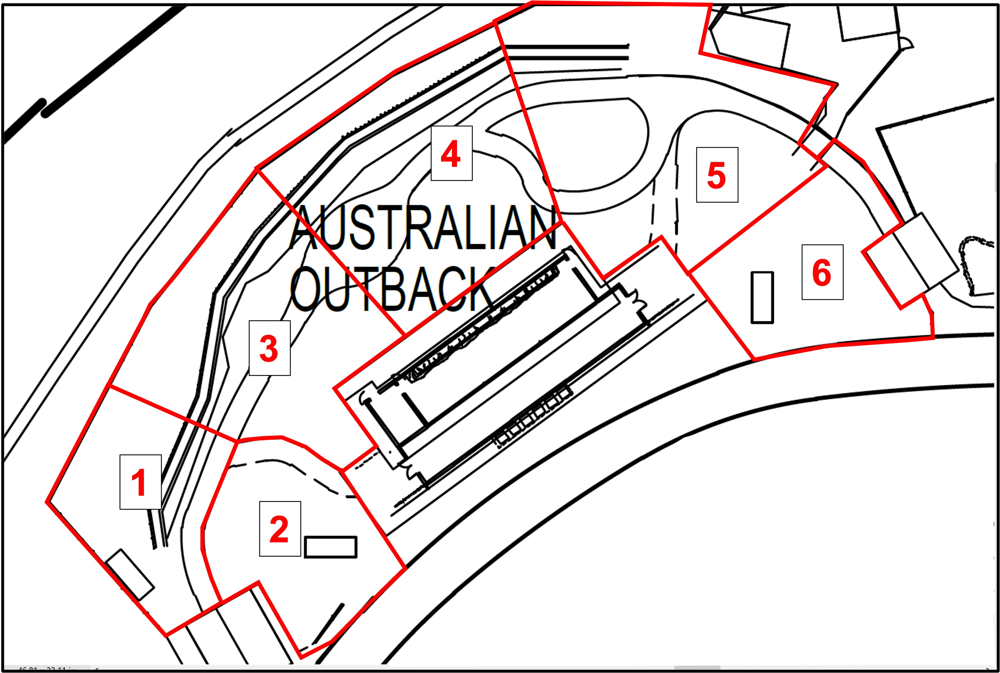

# Material and methods {#methods}


## Study subjects

The study group consisted of 4.2 Eastern Grey kangaroos (GK), 3.0, Bennett's wallaby (BW), and 2.0 Swamp wallaby (SW) living in an environmentally-enriched exhibit at the Singapore Zoo. Like most macropod-themed exhibits, visitors are permitted to walk through the exhibit via a guided trail while feeding and contact with the animals are largely prohibited. Visitorship was not counted in this study, and all individuals in were adults with no prior co-habitation exposure. The lay out of the exhibit is interspersed with natural foliage and logs (plant types) to provide natural shade and cover while feeding and drinking troughs are fixed in specific areas (see Figure \@ref(fig:zones-f)).

## Data Collection

As residents of the exhibit, baseline activity and spatial use data were first collected from the GKs for 10 days (2018-12-07 -- 2018-12-16) prior to the separate introduction of the BWs and SWs (2018-12-17 and 2019-02-27, respectively); activity and spatial use data were then collected for a period of 10 days after the introduction of each wallaby species. However, due to an unrelated health issue, one SW ('Mickey') was removed from the exhibit 7 days post-introduction thus tallying in 25, 15 and 7 days of observational data for the GKs, BWs, and SWs, respectively. As a result, the collected observational data can be grouped into three treatments designed to characterise inter-species interaction (if applicable): T1 (i.e., solely GKs), T2 (i.e., GKs and BWs) and T3 (i.e., GKs, BWs, and SWs).

Behavioural observations were done using instantaneous scan sampling method where a single observation consisting of the behaviour and approximate zonal location (see Figure \@ref(fig:zones-f) for detail) of each individual was recorded. Here, observations were conducted at an hourly interval over a 10 h period that coincides with the operational hours of the exhibit (0900 -- 1800 h). Observations were jotted on paper before being transferred onto a excel file. The descriptions of the recorded behaviours during the observation period are described in Table \@ref(tab:etho-t).

```{r etho-t}
etho = data.frame(
    "Behaviour" = c("Rest", "Vigilance", "Locomotion", "Drinking", "Feeding", "Grooming", "Intra-antagonism", "Intra-mutualism", "Negative interaction", "Positive interactions", "Others", "Out-of-Sight"),
    "Key" = c("Re", "Vi", "Lo", "Dr", "Fe", "Gr", "N", "P", "Nso", "Pso", "O", "OOS"),
  "Description" = c(
    "Sitting or lying with body motionless for at least 30 sec, not moving",
    "Head up, ears pointing upwards.",
    "Moving from point A to point B using any method (pentapedal/bipedal)",
    "Water consumption",
    "Food consumption; grazing and/or browsing",
    "Licking own fur/wiping face with paws",
    "Negative interaction between same species (Fights, Kicks, Etc)",
    "Positive interaction between same species (Grooming, courtship, Etc)",
    "Negative interaction between wallaby and kangaroo (Fights, Kicks, Etc)",
    "Positive interaction between wallaby and kangaroo (elaborate?)",
    "Other behaviours not specified in the ethogram.",
    "Observer is unable to see animal"),
  check.names = FALSE
)

kable(
  etho,
  booktabs = T,
  align = 'l',
  caption = "The ethogram and behavioural key used for examining behaviours in kangaroos and wallabies"
) %>%
  kable_styling(position = "center", 
                latex_options = c("repeat_header"),
                full_width = T) %>%
  column_spec(1:2, width = "8em",latex_valign = "m") %>%
  row_spec(0, bold = T) %>%
  collapse_rows(1, latex_hline = "major")
```

```{r zones-f, fig.margin = TRUE,  out.width = '100%' ,fig.cap = "The separate zonation of the exhibit; description of zones are described in-text. Will be requesting section for a cleaner version."}

```

## Data analysis

Due to the presence of unequal zone sizes, the modified spread of participation (SPI) index [first described by @plowmanNoteModificationSpread2003] was used to examine exhibit use across each zone for each species. As per Original SPI, the values for Modified SPI also vary between 0 and 1 where 0 describes near-perfect space-use of the enclosure while 1 describes the inverse (i.e., uneven space-use).

The formula for deriving the SPI index is simply as follow:

$$
    SPI = \sum \frac {|f_0 - f_e|} {2(N -fe_{min})}
$$

Here, *f~o~* refers to the number of times an animal was observed in a zone, *f~e~* is the expected frequency for the zone (based on the respective size of each zone), *fe~min~* is the expected frequency in the exhibit's smallest zone and N refers to the number of observations for the observation period.

As the Modified SPI only provides a single index that charaterises overall exhibit use, an Electivity Index (EI) was also included to describe exhibit use across each identified zone (see Figure \@ref(fig:zones-f)). Originally conceived for use in ecology [@vanderploegTwoElectivityIndices1979], the EI have been adapted to examine the spatial preference / selection of a broad range of captive animals in exhibits or enclosures under varying degrees of environmental enrichment [see review by @breretonWhichIndexShould2021]. As such, the inclusion of the EI further elucidates variation or differences in exhibit use following intrinsic (e.g., age) and/or extrinsic (e.g., inclusion of furniture) changes. In its computation, the EI for each identified zone is represented by a value ranging between 1 (indicating sole of the zone) and -1 (indicate no use of the zone) while a value of 0 indicates perfect proportional use of the indicated zone in relation to its size. Much like the modified SPI formula described above, the EI is also designed to overcome the challenges associated with unequal zone sizes [@breretonWhichIndexShould2021].

The formula for deriving the EI is simply:

$$
    EI = \frac {W_i - \frac {1} {N}} {W_i + \frac {1} {N}}
$$

$$
    W_i = \frac {\frac {r_i} {p_i}} {\sum \frac{r_i} {p_i}}
$$

Here, *r~i~* refers to the observed use of a resource or zone, and *p~i~* refers to the expected use of a given resource. The letter *N* denotes the total number of zones (*n* = 6; see Figure \@ref(fig:zones-f) or resources available to the study species.

To examine the variations and/or shifts in behaviour of each species post-introduction, species- and treatment-specific activity budgets and the Shannon's Index of Diversity, or Shannon Index, were calculated. Here, the SI is used to examine the diversity of grouped behaviours exhibited by each species and has been applied various other animal-related studies [@menchettiMultiOperatorQualitativeBehavioural2019].

The formula for computing the SI is simply:

$$
    SI = -\sum_{i = 1}^{B}p_i\times ln \times p_i
$$

where *B* is the number of behaviour types (*n* = $\le$ 12; see Table \@ref(tab:etho-t)) and *p~i~* is the proportion of behaviour *i*. Greater index values demonstrates a greater diversity in exhibited behaviour and index values increases linearly with number of behaviour types and abundances. As an index, the SD index is relatively accurate and useful indicator of positive welfare [see @miller2020] and can be used to simply compare between treatments. All analysis were performed with the *dplyr* package [@wickham2015dplyr] within the R environment (version 4.1.2).
